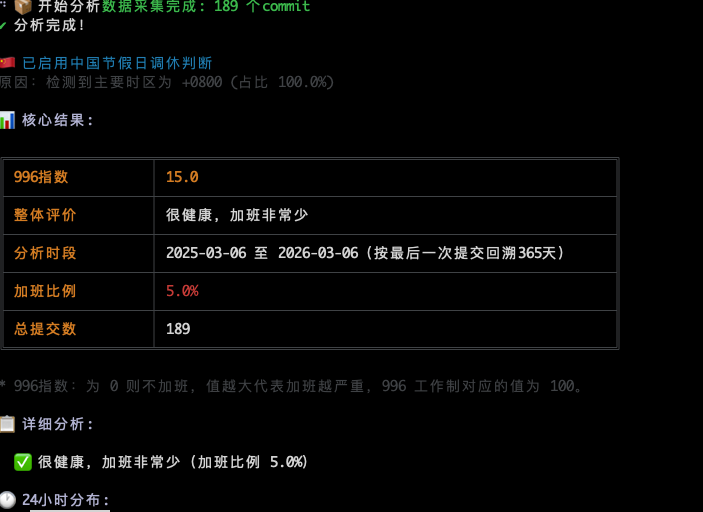

## 一.环境安装
### 0.安装巨魔
官方教程: [巨魔安装](https://trollstore.app/installing-trollhelper/)
**全程挂梯子,建议切换把iCloud账号切换到美区,下载clashmi软件,然后开全局模式,然后使用巨魔安装器安装**

### 1.安装巨魔插件
分别安装,巨魔注入器,DowngradeApp或者AppStore++插件(二选一,降级版本用)
插件文件: TODO

### 2.AppStore安装最新版本钉钉

### 3.降级钉钉版本
使用巨魔插件: DowngradeApp(更加好用)或者AppStore++插件降级钉钉版本到6.5.0版本

### 4.为钉钉注入虚拟工具箱动态库
使用巨魔插件: 巨魔注入器插件,注入虚拟工具箱动态库

## 二.配置使用
### 1.配置定位和wifi信息
在钉钉主界面顶部双击,打开虚拟工具箱
在虚拟工具箱中配置定位和wifi信息

### 2.新建组织测试
在钉钉中自己新建一个组织,然后在里面进行打卡测试,如果能不被检测出,再做实际的测试